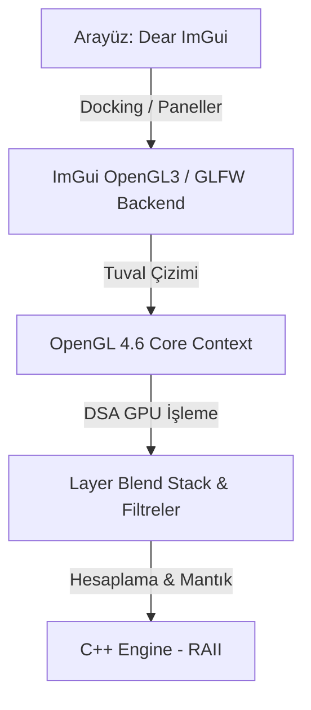

# Graphite Studio 🎨

Graphite Studio, C++20 ve OpenGL 4.6 Core Profile standartları üzerine inşa edilmiş, GPU hızlandırmalı, son derece hafif ve modern bir açık kaynaklı görsel düzenleme yazılımıdır. 

Gereksiz ağırlıklardan arındırılmış, profesyonel standartlarda çalışan, özgür ve topluluk odaklı bir yaratıcı araç sunmayı hedefliyoruz.

---

## ✨ Neden Graphite Studio?

*   **Yerel Performans:** Tauri veya Electron gibi webview tabanlı çözümler yerine, ham C++20 hızı ve doğrudan GPU render (OpenGL 4.6 Core) altyapısı kullanır.
*   **Modern GPU Mimarisi:** Legacy OpenGL binding'leri yerine **Direct State Access (DSA)** mimarisi kullanılarak OpenGL durum kirliliği (global state pollution) ve ImGui çakışmaları tamamen engellenmiştir.
*   **RAII Kaynak Yönetimi:** Tüm OpenGL kaynakları (Buffers, VertexArrays, Textures, Framebuffers) C++ akıllı sarmalayıcı sınıfları ile yönetilir ve Sıfır Kuralı (Rule of Zero) uygulanır.
*   **Hafif ve Taşınabilir:** Minimum bağımlılıkla çalışır, saniyeler içinde açılır ve sistem kaynaklarını yormaz.
*   **Profesyonel İş Akışı:** Sekmeli ve sürüklenebilir paneller (Dear ImGui), esnek dikey araç çubuğu ve tam uyumlu koyu tema.
*   **Topluluk Odaklı (Open Source):** Herkesin katılımına ve katkısına açık, tamamen şeffaf bir geliştirme süreci.

---

## 🚀 Teknolojik Altyapı

*   **Dil Standartı:** C++20 / C++23.
*   **Arayüz (GUI):** [Dear ImGui](https://github.com/ocornut/imgui) (Docking Branch) - Yüksek özelleştirilebilir arayüz elemanları.
*   **Pencere ve Girdi:** [GLFW](https://github.com/glfw/glfw) - Çapraz platform pencere yönetimi ve hassas girdi okuma.
*   **Grafik API / Render:** OpenGL 4.6 (Core Profile) ve GLSL piksel shader'ları.
*   **Derleme Sistemi:** CMake 3.20+.



---

## 📂 Klasör Yapısı

```text
GraphiteStudio/
├── CMakeLists.txt         # CMake yapılandırma dosyası
├── README.md              # Bu dosya
├── ROADMAP.md             # Geliştirme yol haritası
├── docs/                  # Detaylı mimari ve API dökümanları
├── include/               # C++ Başlık (.h) dosyaları
│   ├── core/              # Görüntü işleme motoru, katman yapıları, Undo/Redo, RAII sarmalayıcılar
│   ├── gui/               # ImGui panelleri ve tema kodları
│   └── platform/          # Dosya diyalogları ve UTF dönüştürme araçları
├── src/                   # C++ Kaynak (.cpp) dosyaları
│   ├── main.cpp           # Uygulama giriş noktası
│   ├── core/              # Görüntü motoru ve RAII sarmalayıcı implementasyonları
│   ├── gui/               # Arayüz panel ve görünüm implementasyonları
│   └── platform/          # Platforma özel native fonksiyonlar
└── thirdparty/            # Harici hafif kütüphaneler (stb_image vb.)
```

---

## 🛠️ Derleme ve Çalıştırma

### Gereksinimler
*   **C++ Derleyici:** Modern C++20 destekleyen bir derleyici (Visual Studio 2026 / MSVC, GCC 11+ veya Clang 12+).
*   **CMake:** Sürüm 3.20 veya üzeri.
*   **Grafik Kartı:** OpenGL 4.6 destekleyen ekran kartı ve güncel sürücüler.

### Kurulum Adımları

#### Windows (PowerShell / CMD)
1.  Projeyi indirin ve proje dizinine geçin:
    ```bash
    cd GraphiteStudio
    ```
2.  Yapılandırma dosyalarını oluşturun (Kurulu Visual Studio sürümünüze uygun generator belirtiniz, örneğin VS 2026):
    ```bash
    cmake -G "Visual Studio 18 2026" -A x64 -B build
    ```
3.  Uygulamayı derleyin:
    ```bash
    cmake --build build --config Release
    ```
4.  Uygulamayı çalıştırın:
    ```bash
    ./build/Release/GraphiteStudio.exe
    ```

---

## 🤝 Katkıda Bulunma (Contribution)

Graphite Studio, gücünü topluluktan alan bir projedir. Kod yazarak, hata bildirerek, tasarım fikirleri sunarak veya dokümantasyonu geliştirerek bize katkıda bulunabilirsiniz!

1.  Projedeki güncel hedelteleri görmek için [ROADMAP.md](file:///c:/Dev/ImageEditor/ROADMAP.md) dosyasını inceleyin.
2.  Geliştirmek istediğiniz özellik için bir **Issue** açın veya mevcut bir issue üzerinden tartışmaya katılın.
3.  Değişikliklerinizi yapıp test ettikten sonra temiz bir **Pull Request (PR)** gönderin.

Gelin, hep birlikte herkes için harika bir görsel düzenleyici geliştirelim! 🚀
