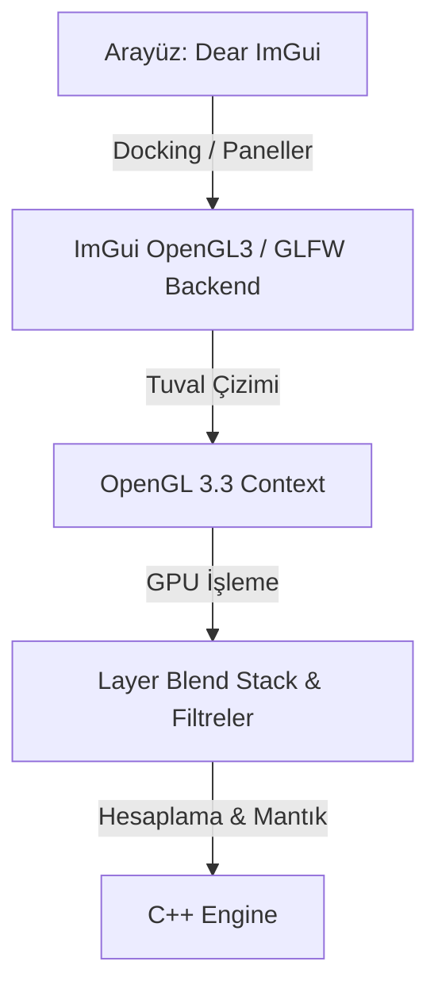

# Graphite Studio 🎨

Graphite Studio, C++20 ve OpenGL 3.3 standartları üzerine inşa edilmiş, GPU hızlandırmalı, son derece hafif ve modern bir açık kaynaklı görsel düzenleme yazılımıdır. 

Gereksiz ağırlıklardan arındırılmış, profesyonel standartlarda çalışan, özgür ve topluluk odaklı bir yaratıcı araç sunmayı hedefliyoruz.

---

## ✨ Neden Graphite Studio?

*   **Yerel Performans:** Tauri veya Electron gibi webview tabanlı çözümler yerine, ham C++20 hızı ve doğrudan GPU render (OpenGL 3.3) altyapısı kullanır.
*   **Hafif ve Taşınabilir:** Minimum bağımlılıkla çalışır, saniyeler içinde açılır ve sistem kaynaklarını yormaz.
*   **Profesyonel İş Akışı:** Sekmeli ve sürüklenebilir paneller (Dear ImGui), esnek dikey araç çubuğu ve tam uyumlu koyu tema.
*   **Topluluk Odaklı (Open Source):** Herkesin katılımına ve katkısına açık, tamamen şeffaf bir geliştirme süreci.

---

## 🚀 Teknolojik Altyapı

*   **Arayüz (GUI):** [Dear ImGui](https://github.com/ocornut/imgui) (Docking Branch) - Yüksek özelleştirilebilir arayüz elemanları.
*   **Pencere ve Girdi:** [GLFW](https://github.com/glfw/glfw) - Çapraz platform pencere yönetimi ve hassas girdi okuma.
*   **Grafik API / Render:** OpenGL 3.3 (Core Profile) ve GLSL piksel shader'ları.
*   **Derleme Sistemi:** CMake 3.20+.



---

## 📂 Klasör Yapısı

```text
GraphiteStudio/
├── CMakeLists.txt         # CMake yapılandırma dosyası
├── README.md              # Bu dosya
├── ROADMAP.md             # Geliştirme yol haritası
├── include/               # C++ Başlık (.h) dosyaları
│   ├── core/              # Görüntü işleme motoru, katman yapıları, Undo/Redo
│   └── gui/               # ImGui panelleri ve tema kodları
├── src/                   # C++ Kaynak (.cpp) dosyaları
│   ├── main.cpp           # Uygulama giriş noktası ve döngüsü
│   ├── core/              # Görüntü motoru kodları
│   └── gui/               # Arayüz panel implementasyonları
└── thirdparty/            # Harici hafif kütüphaneler (stb_image vb.)
```

---

## 🛠️ Derleme ve Çalıştırma

### Gereksinimler
*   **C++ Derleyici:** Modern C++20 destekleyen bir derleyici (Visual Studio 2026 / MSVC, GCC 11+ veya Clang 12+).
*   **CMake:** Sürüm 3.20 veya üzeri.
*   **Grafik Kartı:** OpenGL 3.3 veya üzerini destekleyen ekran kartı ve sürücüler.

### Kurulum Adımları

#### Windows (PowerShell / CMD)
1.  Projeyi indirin ve proje dizinine geçin:
    ```bash
    cd GraphiteStudio
    ```
2.  Yapılandırma dosyalarını oluşturun:
    ```bash
    cmake -B build
    ```
3.  Uygulamayı derleyin:
    ```bash
    cmake --build build --config Release
    ```
4.  Uygulamayı çalıştırın:
    ```bash
    ./build/Release/GraphiteStudio.exe
    ```

---

## 🤝 Katkıda Bulunma (Contribution)

Graphite Studio, gücünü topluluktan alan bir projedir. Kod yazarak, hata bildirerek, tasarım fikirleri sunarak veya dokümantasyonu geliştirerek bize katkıda bulunabilirsiniz!

1.  Projedeki güncel hedefleri görmek için [ROADMAP.md](file:///c:/Dev/ImageEditor/ROADMAP.md) dosyasını inceleyin.
2.  Geliştirmek istediğiniz özellik için bir **Issue** açın veya mevcut bir issue üzerinden tartışmaya katılın.
3.  Değişikliklerinizi yapıp test ettikten sonra temiz bir **Pull Request (PR)** gönderin.

Gelin, hep birlikte herkes için harika bir görsel düzenleyici geliştirelim! 🚀
