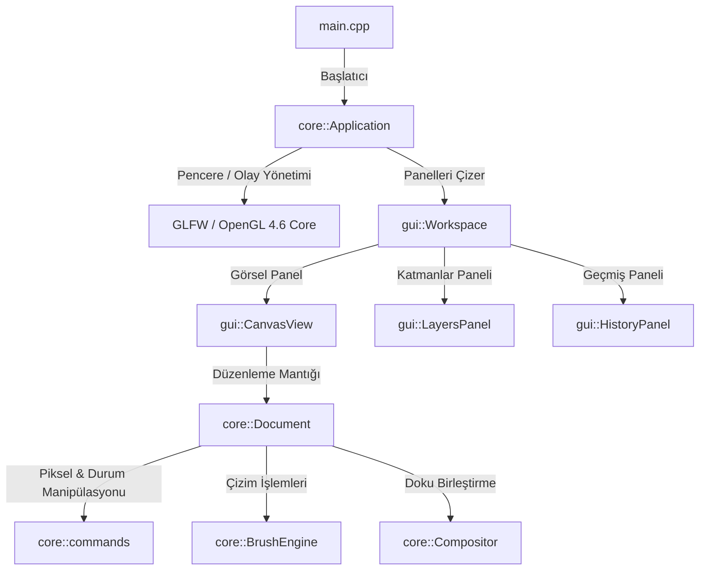

# Graphite Studio — Mimari Dokümantasyonu (Architecture)

Graphite Studio, modern yazılım tasarım kalıpları (SOLID, DRY) ve performans odaklı C++ pratikleri temel alınarak modüler bir yapıda tasarlanmıştır.

## 🏢 Genel Sistem Mimarisi

Uygulama, sorumlulukların net şekilde ayrıştırıldığı katmanlı bir mimariye (Layered Architecture) sahiptir:

---

## 🔑 Çekirdek Bileşenler

### 1. `core::Application`
Uygulamanın ana döngüsünü (main loop), pencere yönetimini, GLFW/ImGui context başlatılmasını ve klavye kısayollarını koordine eder. Tekil sorumluluk prensibine (SRP) uyar; `main.cpp` sadece bu sınıfı başlatır.

### 2. `core::Document`
Geçerli belgenin durumunu (katmanlar, tuval boyutları, yüklenen dosya yolları vb.) ve geçmiş yöneticisini (`core::HistoryManager`) tutar. Kullanıcı arayüzü (`gui::CanvasView`) ile veri modelini birbirinden ayırır.

### 3. Katman İşlem Komutları (`core::commands`)
Komut tasarım deseni (Command Pattern) kullanılarak, katman ekleme, çoğaltma, silme ve birleştirme gibi işlemler izole edilmiştir. Bu sayede:
- Tüm işlemler tek merkezden çağrılır ve tekrarlanan kodların (DRY) önüne geçilir.
- Geçmiş yöneticisine (`HistoryManager`) otomatik olarak durum kayıtları gönderilir.

### 4. `core::BrushEngine` & `core::BlendMath`
- **`BrushEngine`**: Kullanıcının fare hareketlerini ve çizgi çizim interpolasyonunu yönetir. Fare hızından bağımsız olarak kesintisiz, pürüzsüz darbeler üretir.
- **`BlendMath`**: Alfa kompozisyon ve Porter-Duff formüllerinin matematiksel hesaplamalarını tek bir yerde toplar. Hem CPU (LayerStack birleştirmeleri) hem de dolaylı olarak GPU hesaplama mantığına rehberlik eder.

---

## 🎨 GPU ve İşleme Modülü

Uygulamanın GPU işleme mimarisi tamamen OpenGL 4.6 DSA ve RAII prensiplerine dayanmaktadır.

- Detaylı GPU mimari analizi için [docs/gpu_subsystem.md](file:///c:/Dev/ImageEditor/docs/gpu_subsystem.md) dosyasını inceleyin.
